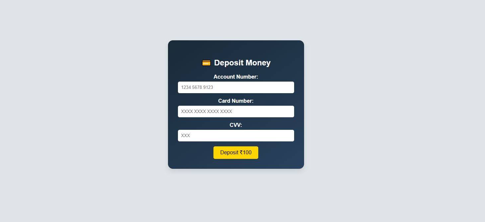
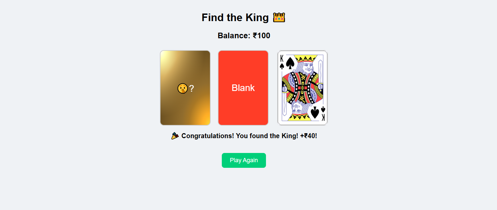
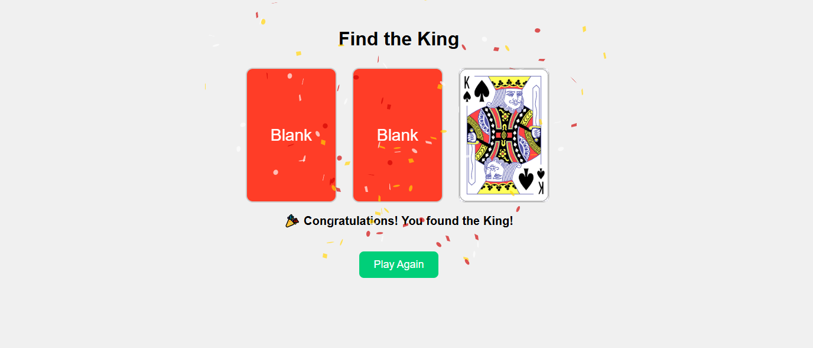

# Getting Started with Create React App

This project was bootstrapped with [Create React App](https://github.com/facebook/create-react-app).

### `Demo here`
To view the demo: [click here](https://vermadilip.github.io/find-the-king/)

## Project Description: Find the King Card Game
Overview
Find the King is an interactive and engaging card game designed to entertain players of all ages. The objective is simple: identify the King card hidden among a trio of cards. With a sleek design and fun gameplay mechanics, this game combines elements of chance and strategy, making it a delightful experience for everyone.

### `Features`
Simple Gameplay: Players click on one of the three cards to reveal its identity. Only one card is the King, while the others are blanks.\

Visual Appeal: The game features visually appealing card designs, including a vibrant image of a crown for the King card, enhancing the overall aesthetics.\

Immediate Feedback: Players receive instant feedback upon guessing, with congratulatory messages for finding the King and encouragement to try again for incorrect guesses.\

Confetti Celebration: Upon successfully finding the King card, players are greeted with a fun confetti animation, adding excitement and a sense of achievement.\

Restart Option: After the game concludes, players can easily restart to play again, ensuring replayability and continuous fun.\

### `Technology Stack`
React: The game is built using React, allowing for a dynamic and responsive user interface.
CSS for Styling: Custom CSS styles enhance the visual appeal and layout of the game, ensuring a polished look and feel.\

### `Target Audience`
Find the King is designed for casual gamers, families, and anyone looking for a quick and entertaining way to test their luck. Its straightforward mechanics make it easy for new players to pick up while providing enough excitement to keep them coming back for more.\

### `Conclusion`
With its captivating gameplay and modern design, Find the King is more than just a game; it's a fun way to engage with friends and family. Whether played in short bursts or extended sessions, it promises to deliver enjoyment and a bit of friendly competition.\

## Available Scripts

In the project directory, you can run:

### `npm start`

Runs the app in the development mode.\
Open [http://localhost:3000](http://localhost:3000) to view it in your browser.

The page will reload when you make changes.\
You may also see any lint errors in the console.

### `npm test`

Launches the test runner in the interactive watch mode.\
See the section about [running tests](https://facebook.github.io/create-react-app/docs/running-tests) for more information.

### `npm run build`

Builds the app for production to the `build` folder.\
It correctly bundles React in production mode and optimizes the build for the best performance.

The build is minified and the filenames include the hashes.\
Your app is ready to be deployed!

See the section about [deployment](https://facebook.github.io/create-react-app/docs/deployment) for more information.

### `npm run eject`

**Note: this is a one-way operation. Once you `eject`, you can't go back!**

If you aren't satisfied with the build tool and configuration choices, you can `eject` at any time. This command will remove the single build dependency from your project.

Instead, it will copy all the configuration files and the transitive dependencies (webpack, Babel, ESLint, etc) right into your project so you have full control over them. All of the commands except `eject` will still work, but they will point to the copied scripts so you can tweak them. At this point you're on your own.

You don't have to ever use `eject`. The curated feature set is suitable for small and middle deployments, and you shouldn't feel obligated to use this feature. However we understand that this tool wouldn't be useful if you couldn't customize it when you are ready for it.

## Learn More

You can learn more in the [Create React App documentation](https://facebook.github.io/create-react-app/docs/getting-started).

To learn React, check out the [React documentation](https://reactjs.org/).

### Code Splitting

This section has moved here: [https://facebook.github.io/create-react-app/docs/code-splitting](https://facebook.github.io/create-react-app/docs/code-splitting)

### Analyzing the Bundle Size

This section has moved here: [https://facebook.github.io/create-react-app/docs/analyzing-the-bundle-size](https://facebook.github.io/create-react-app/docs/analyzing-the-bundle-size)

### Making a Progressive Web App

This section has moved here: [https://facebook.github.io/create-react-app/docs/making-a-progressive-web-app](https://facebook.github.io/create-react-app/docs/making-a-progressive-web-app)

### Advanced Configuration

This section has moved here: [https://facebook.github.io/create-react-app/docs/advanced-configuration](https://facebook.github.io/create-react-app/docs/advanced-configuration)

### Deployment

This section has moved here: [https://facebook.github.io/create-react-app/docs/deployment](https://facebook.github.io/create-react-app/docs/deployment)

### `npm run build` fails to minify

This section has moved here: [https://facebook.github.io/create-react-app/docs/troubleshooting#npm-run-build-fails-to-minify](https://facebook.github.io/create-react-app/docs/troubleshooting#npm-run-build-fails-to-minify)
